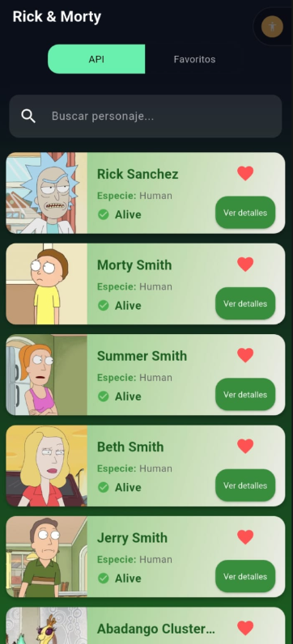
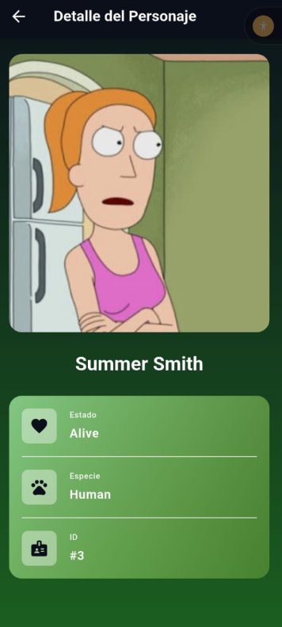
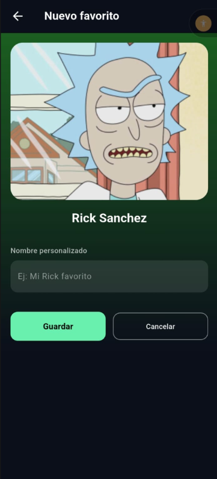
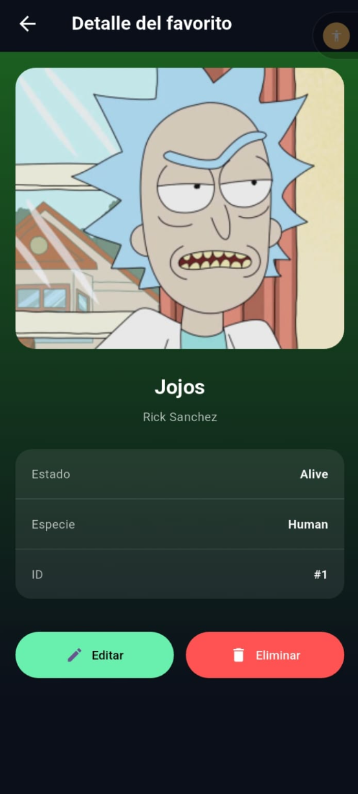
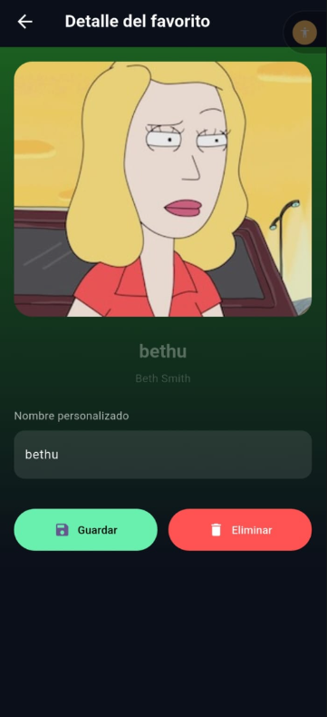

Perfecto 👌
Aquí tienes un **README.md completo, profesional y alineado al nivel técnico** del proyecto que hemos construido (Flutter + BLoC + Clean Architecture + SQLite + API + PageView).

Puedes copiarlo **tal cual** a la raíz del proyecto.

---

```md
# Rick & Morty Multiverse App 🧪🛸

Aplicación móvil desarrollada en **Flutter** que consume la API pública de **Rick & Morty**, permite explorar personajes, buscarlos en tiempo real y guardarlos como **favoritos persistentes** usando **SQLite**.  
La app está construida siguiendo **Clean Architecture**, **BLoC/Cubit**, **Atomic Design** y una **navegación moderna con GoRouter y PageView**.

---

## 📱 Características principales

- 🔍 **Listado de personajes desde API**
- 🔎 **Búsqueda en tiempo real (search independiente por vista)**
- ❤️ **Guardar personajes como favoritos**
- ✏️ **Editar nombre personalizado de favoritos**
- 🗑️ **Eliminar favoritos**
- 💾 **Persistencia local con SQLite**
- 🔁 **Estado consistente con Cubit**
- 📂 **Arquitectura escalable por features**
- 🧭 **Navegación por Tabs + Swipe (PageView)**
- 🌙 **UI Dark Mode con gradientes personalizados**

---

## 🧠 Arquitectura

El proyecto sigue una **Clean Architecture por features**:

```

lib/
├─ core/
│  ├─ routes/
│  ├─ database/
│  └─ theme/
│
├─ features/
│  ├─ api-items/
│  │   ├─ data/
│  │   ├─ domain/
│  │   └─ presentation/
│  │
│  ├─ prefs/
│  │   ├─ data/
│  │   ├─ domain/
│  │   └─ presentation/
│  │
│  └─ combined/
│
└─ main.dart

```

### Principios aplicados

- Clean Architecture (Data / Domain / Presentation)
- BLoC (Cubit)
- Atomic Design (atoms / molecules / organisms)
- Single Source of Truth
- Separation of Concerns

---

## 🧩 Tecnologías utilizadas

| Tecnología | Uso |
|----------|-----|
| Flutter | Framework principal |
| flutter_bloc | Manejo de estado |
| go_router | Navegación |
| dio | Consumo de API |
| sqflite | Persistencia local |
| path_provider | Rutas de DB |
| equatable | Comparación de estados |

---

## 🌐 API utilizada

- **Rick & Morty API**
```

[https://rickandmortyapi.com/api/character/1,2,3](https://rickandmortyapi.com/api/character/1,2,3)

````

## 🚀 Instalación

1️⃣ Clonar el repositorio:

```bash
git clone git@github.com:CrisisTecno/flutter_bloc_sqlite_test.git
````

2️⃣ Entrar al proyecto:

```bash
cd flutter_bloc_sqlite_test
```

3️⃣ Instalar dependencias:

```bash
flutter pub get
```

---

## ▶️ Ejecución

### Android / iOS

```bash
flutter run
```

### Web (opcional)

```bash
flutter run -d chrome
```

---

## 🧪 Flujo de la aplicación

1. **SplashScreen**

   * Carga inicial
   * Preparación de la app

2. **Vista combinada**

   * Tabs:

     * API Characters
     * Mis Favoritos
   * Navegación por swipe o tabs

3. **API Characters**

   * Listado desde API
   * Search en tiempo real
   * Guardar como favorito

4. **Mis Favoritos**

   * Persistidos en SQLite
   * Search local
   * Editar / Eliminar
   * Detalle completo

---

## 🧠 Decisiones técnicas clave

* El **search es independiente por feature**
* El **PageView no controla estado de búsqueda**
* SQLite es la única fuente de verdad para favoritos
* El Cubit nunca depende de UI
* Los detalles no rompen el estado del listado

---

## 📌 Posibles mejoras futuras

* 🔄 Paginación infinita
* 🧪 Tests unitarios y de widgets

---

       